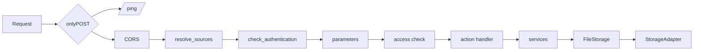

# Architecture

## Layout

```text
src/jcpy/
├── app.py            # create_app(), create_router()
├── connector.py      # Connector: routes and the request pipeline
├── context.py        # parameters of a request, ActionContext
├── config/           # AppConfig / SourceConfig models, JSON loading
├── acl.py            # AccessControl
├── sources.py        # Source, SourcePool: root confinement, name rules
├── tenants.py        # dynamic sources and their cache
├── storage/          # StorageAdapter protocol, local and S3 adapters
├── services/         # listing, thumbnails, uploads, file operations, images
├── documents/        # PDF (WeasyPrint), DOCX (html-for-docx)
├── helpers/          # ports of qs, bytes, Day.js, slugify...; SSRF guard
├── openapi/          # documentation schemas and the OpenAPI builder
└── v1/               # one package per action: <action>/handler.py
```

## Request pipeline



Every failure along the way becomes the error envelope with the right status; uploaded temporary files are closed when the request ends.

## Instances

A `Connector` owns its configuration, callbacks, access control, source pool and tenant cache. `create_router()` makes a new one each call, so instances in one process share nothing but the storage adapter registry.

## Configuration

`AppConfig` and `SourceConfig` are frozen Pydantic models with camelCase JSON names. User JSON is merged over the defaults, validated once at start, and per-source overrides are turned into a separate `AppConfig` per source (`AppConfig.for_source`).

## Sources and storage

- `Source` resolves request paths against its root, rejects paths that leave it (symlinks included), checks names and extensions, and builds URLs from `baseurl`.
- `FileStorage` normalizes paths and wraps adapter errors in messages naming the failed operation.
- Adapters only move bytes: local files (in worker threads) or S3 (boto3 in worker threads).

## Validation

Parameters are validated per action; every problem is reported in `messages` (`box: Invalid input: expected object, received undefined`). The Pydantic models in `jcpy.openapi` describe the wire format for the documentation; a test checks real answers against them.

## Client-visible formats

Behaviour the client relies on is checked against reference fixtures (`tests/fixtures/`): bracket parameter parsing (`box[w]`, `mods[sortBy]`), multipart field names, size and date formats, safe file names and slugs, path handling, URL parsing and the listing sort order.
